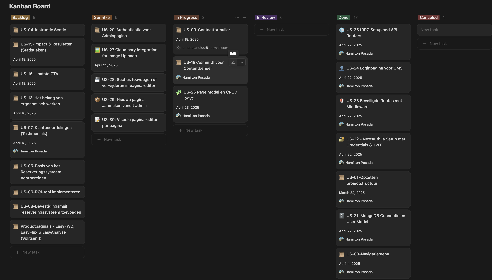

# User Stories – Websiteproject 4U Solutions BV

In dit document vind je de uitgewerkte user stories voor het project.
Elke user story volgt het formaat: **"Als [rol] wil ik [doel] zodat ik [waarom]".**

---

## Definition of Done (DoD)

Een user story is pas "done" als:
- De acceptatiecriteria zijn gehaald
- De code is getest en werkt zonder fouten
- Peer review is gedaan
- De feature is responsive en visueel goedgekeurd
- De story is gedocumenteerd in Github

---

## User Stories

| ID     | Als...          | wil ik...                                         | zodat ik...                                     | Status        | Prioriteit | Uren |
|--------|------------------|--------------------------------------------------|------------------------------------------------|--------------|------------|------|
| US-01  | ontwikkelaar     | een projectstructuur opzetten                    | een schaalbare en overzichtelijke basis heb     | Done         | Must       | 2    |
| US-03  | bezoeker         | kunnen navigeren via een menu                   | snel de juiste informatie vind                  | Done         | Must       | 3    |
| US-07  | bezoeker         | klantbeoordelingen (testimonials) kunnen lezen  | ik vertrouwen krijg in EasyFWD                  | Done         | High       | 3    |
| US-10  | bezoeker         | direct begrijpen wat EasyFWD is                 | ik snel kan beslissen of het relevant is        | Done         | Must       | 3    |
| US-14  | bezoeker         | prijzen van de verschillende pakketten zien     | ik een passende keuze kan maken                 | Done         | High       | 3    |
| US-17  | bezoeker         | contactinformatie onderaan de site zien         | ik makkelijk contact kan opnemen                | Done         | Medium     | 2    |
| US-18  | ontwikkelaar     | MongoDB database opzetten voor contentbeheer    | gebruikersdata veilig en schaalbaar opslaan     | Done         | Must       | 2    |
| US-19  | beheerder        | Admin UI voor contentbeheer bouwen              | eenvoudig content aanmaken, wijzigen, verwijderen | Done      | Must       | 5    |
| US-21  | ontwikkelaar     | een MongoDB User-model koppelen voor authenticatie en rolbeheer | gebruikers veilig kunnen inloggen en beheerd worden | Done   | Must       | 4    |
| US-22  | ontwikkelaar     | NextAuth.js met credentials login en JWT instellen | het CMS veilig toegankelijk is                | Done         | Must       | 3    |
| US-23  | ontwikkelaar     | middleware toevoegen voor beveiligde admin-routes | alleen geautoriseerde gebruikers toegang hebben | Done         | Must       | 3    |
| US-24  | beheerder        | een loginpagina voor het CMS ontwikkelen        | alleen admins kunnen inloggen                   | Done         | Must       | 2    |
| US-25  | ontwikkelaar     | tRPC setup en API routers bouwen                | type-safe endpoints voor het CMS                | Done         | Must       | 4    |
| US-26  | beheerder        | pagina's CRUD (aanmaken, bewerken, verwijderen) | de inhoud van de website beheren                | In Progress  | Must       | 5    |
| US-28  | beheerder        | Secties toevoegen/verwijderen in pagina-editor  | pagina's flexibel kunnen indelen                | In Progress  | Should     | 3    |
| US-29  | beheerder        | Nieuwe pagina's aanmaken vanuit admin           | snel nieuwe content publiceren                  | In Progress  | Should     | 2    |
| US-30  | beheerder        | Visuele pagina-editor per pagina                | pagina's visueel kunnen bewerken in het CMS     | In Progress  | Should     | 2    |

---

## 📎 Screenshot bewijs

De screenshot hieronder toont een voorbeeld van de user stories in Notion van de dag 5.

---

## Koppeling met Planning

De bovenstaande user stories zijn gekoppeld aan de planning in criterium 1.3.