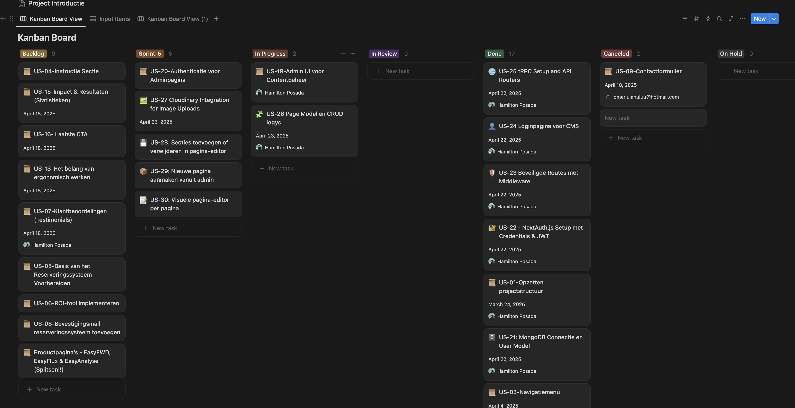

# 🗓️ Planning - Website 4U Solutions BV

De werkzaamheden zijn verdeeld over sprints. De planning is opgesteld op basis van prioriteit (MoSCow), technische afhankelijkheden en haalbaarheid. De planning is gemaakt in Notion.

---

## Sprint 5 – User Stories Planning

| **User Story**         | **Omschrijving**                                                               | **US-ID** | **Prioriteit** |
| ---------------------- | ------------------------------------------------------------------------------ | --------- | -------------- |
| **Loginpagina CMS**    | Ontwikkel een veilige loginpagina voor het admin dashboard                     | US-24     | Must           |
| **tRPC Setup & Routers** | Zet tRPC op en bouw API-routers voor het CMS                                 | US-25     | Must           |
| **Page Model & CRUD**  | Implementeer het page-model en CRUD-functionaliteit voor pagina's              | US-26     | Must           |
| **Cloudinary Uploads** | Integreer Cloudinary voor image uploads in het CMS                             | US-27     | Should         |
| **Sectiebeheer Editor**| Mogelijkheid om secties toe te voegen/verwijderen in de pagina-editor          | US-28     | Should         |
| **Nieuwe pagina admin**| Nieuwe pagina's kunnen aanmaken vanuit het admin dashboard                     | US-29     | Should         |
| **Visuele pagina-editor** | Visuele editor voor pagina's in het CMS                                     | US-30     | Should         |
| **Admin UI voor Contentbeheer** | Bouw een beheeromgeving voor content aanmaken/wijzigen/verwijderen      | US-19     | Must           |

---

## Sprint Planning Overzicht

| Sprint   | Taken                                                      |
| -------- | ---------------------------------------------------------- |
| Sprint 1 | US-01 – Opzetten projectstructuur                          |
|          | US-03 – Navigatiemenu                                      |
| Sprint 2 | US-10 – Hero Sectie (Introductie & CTA)                    |
|          | US-17 – Footer                                             |
| Sprint 3 | US-14 – Prijssectie (Brons, Zilver, Goud)                  |
|          | US-18 – MongoDB Setup voor Contentbeheer                   |
|          | US-21 – MongoDB Connectie en User Model                    |
|          | US-22 – NextAuth.js Setup met Credentials & JWT            |
|          | US-23 – Beveiligde Routes met Middleware                   |
| Sprint 4 | US-18 – MongoDB Setup voor Contentbeheer                   |
|          | US-21 – MongoDB Connectie en User Model                    |
|          | US-22 – NextAuth.js Setup met Credentials & JWT            |
|          | US-23 – Beveiligde Routes met Middleware                   |
| Sprint 5 | US-24 – Loginpagina voor CMS                               |
|          | US-25 – tRPC Setup & API Routers                           |
|          | US-26 – Page Model & CRUD logyc                            |
|          | US-27 – Cloudinary Integration for Image Uploads           |
|          | US-28 – Secties toevoegen/verwijderen in pagina-editor     |
|          | US-29 – Nieuwe pagina aanmaken vanuit admin                |
|          | US-30 – Visuele pagina-editor per pagina                   |
|          | US-19 – Admin UI voor Contentbeheer                        |

---

## Sprintverdeling per user story

| Sprint 1 | Sprint 2 | Sprint 3 | Sprint 4 | Sprint 5 |
| -------- | -------- | -------- | -------- | -------- |
| US-01    | US-10    | US-14    | US-18    | US-24    |
| US-03    | US-17    |          | US-21    | US-25    |
|          |          |          | US-22    | US-26    |
|          |          |          | US-23    | US-27    |
|          |          |          |          | US-28    |
|          |          |          |          | US-29    |
|          |          |          |          | US-30    |
|          |          |          |          | US-19    |

---

## 📎 Screenshot Sprint 5 Planning

## 🧾 Sprintoverzicht per User Story

| **Sprint 1** | **Sprint 2** | **Sprint 3** | **Sprint 4** | **Sprint 5** |
|-------------|--------------|--------------|--------------|--------------|
| US-01       | US-10        | US-14        | US-18        | US-24        |
| US-03       | US-17        |              | US-21        | US-25        |
|             |              |              | US-22        | US-26        |
|             |              |              | US-23        | US-27        |
|             |              |              |              | US-28        |
|             |              |              |              | US-29        |
|             |              |              |              | US-30        |
|             |              |              |              | US-19        |

## 📌 Toelichting 

- **Sprint 1:**
  De focus lag op het neerzetten van een solide basis voor het project, zoals de projectstructuur en de eerste UI-elementen. Dit was essentieel om in latere sprints snel te kunnen doorontwikkelen.

- **Sprint 2:**
  In deze sprint stond het uitwerken van de belangrijkste content en conversie-elementen centraal, zoals de hero-sectie en de footer. Stories liepen soms door uit Sprint 1 vanwege extra feedback en styling.

- **Sprint 3:**
  Hier werd gewerkt aan afronding en validatie van bestaande onderdelen, en is de prijssectie toegevoegd. Feedback van de opdrachtgever is direct verwerkt.

- **Sprint 4:**
  De nadruk lag op het afronden van openstaande stories, het verbeteren van de gebruikerservaring en het toevoegen van backend- en securityfunctionaliteit.

- **Sprint 5:**
  Deze sprint stond volledig in het teken van het bouwen van het CMS: login, backend, pagina's beheren. De stories zijn gekozen op basis van technische afhankelijkheden en prioriteit. De voortgang werd dagelijks bijgehouden in Notion.

## 📊 Sprint 5 voortgangsoverzicht

We houden de voortgang bij via een Scrum Board in Notion.

Hieronder een voorbeeld van de status van de sprint:

### **Sprint 5 Voortgang:**

✅ Loginpagina CMS  
✅ tRPC Setup & API Routers  
✅ Page Model & CRUD logic  
✅ Secties toevoegen/verwijderen in pagina-editor  
✅ Nieuwe pagina aanmaken vanuit admin  
✅ Visuele pagina-editor per pagina  
✅ Admin UI voor Contentbeheer