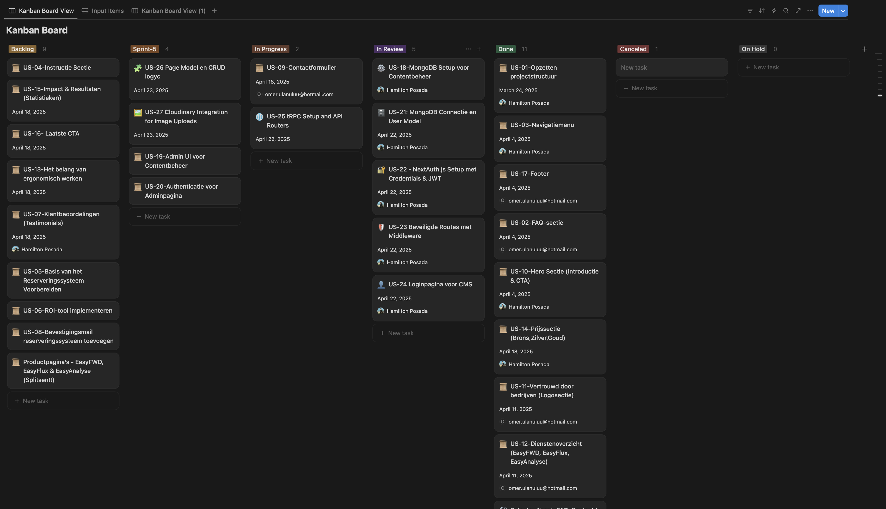
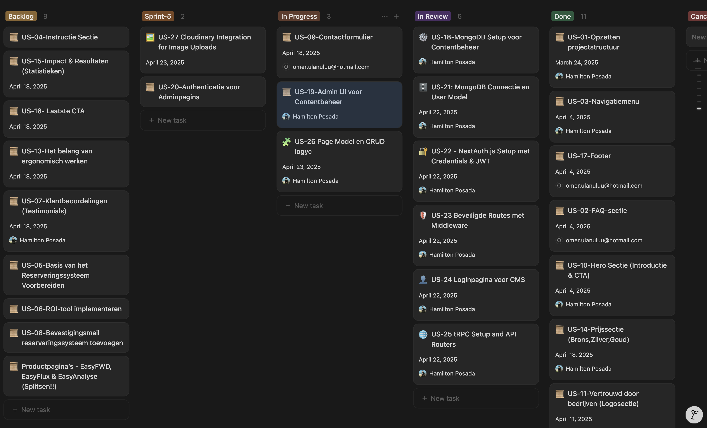

# Voortgangsbewaking – Websiteproject 4U Solutions BV

Tijdens het project hield ik de voortgang dagelijks bij in het Scrum board in Notion. Hieronder volgt een overzicht van Sprint 5, de doelen, de user stories en per dag een screenshot met uitleg.

---

## 🟠 Sprint 5 – Doelen & User Stories

Sprint 5 stond volledig in het teken van het bouwen en afronden van het CMS (Content Management Systeem) voor de website van 4U Solutions BV. In deze sprint zijn zowel backend- als frontend-functionaliteiten gerealiseerd, met de nadruk op beheer, beveiliging en gebruiksvriendelijkheid voor admins.

### Belangrijkste doelen van Sprint 5:
- Het CMS volledig functioneel maken voor beheerders.
- Beveiligde toegang en gebruikersbeheer implementeren.
- Pagina's en content flexibel kunnen beheren en bewerken.
- Afbeeldingen kunnen uploaden en pagina's visueel kunnen samenstellen.

### 📋 User Stories in Sprint 5

| User Story | Omschrijving |
|------------|--------------|
| **US-19**  | Admin UI voor Contentbeheer |
| **US-20**  | Authenticatie voor Adminpagina |
| **US-24**  | Loginpagina CMS |
| **US-25**  | tRPC Setup & API Routers |
| **US-26**  | Page Model & CRUD |
| **US-27**  | Cloudinary Uploads |
| **US-28**  | Sectiebeheer Editor |
| **US-29**  | Nieuwe pagina admin |
| **US-30**  | Visuele pagina-editor |

---

## 📆 Sprint 5: Dagelijks Overzicht

### 📅 Dag 1 – 19 mei 2025

**Uitleg voortgang:**
- Start van Sprint 5: de eerste stories US-24 staat in "In review", en het Us-25 is in "In Progress".
- US-18 t/m US-23 zijn in "In Review". Deze stories zijn van de vorige sprints.
- De basis voor het CMS wordt gelegd.

**Sprint 5 stories op het board:**
- Us-09 is van mijn collega.
- US-18 t/m US-23 zijn in "In Review".
- US-19, US-20, US-26, US-27 zijn toegevoegd aan de sprint 5.
- US-25 zijn in "In Progress".

---

### 📅 Dag 2 – 20 mei 2025

**Uitleg voortgang:**
- US-24 (Loginpagina CMS) en US-25 (tRPC Setup) zijn in review. Ik had wat problemen met de loginpagina, maar die heb ik opgelost.
- US-26 (Page Model & CRUD) is toegevoegd aan "In Progress".

**Sprint 5 stories op het board:**
- US-24 en US-25 staan in "In review".
- US-26 is toegevoegd aan "In Progress".

---

### 📅 Dag 3 – 21 mei 2025

**Uitleg voortgang:**
- US-19 (Admin UI voor Contentbeheer) en US-26 (Page Model & CRUD) staan in "In Progress". Ik heb met de US-19 begonnen om een overzicht te maken, zodat ik de US-26 kon testen.

**Sprint 5 stories op het board:**
- US-24 in "In Review".
- US-25 in "In Review".
- US-26 in "In Progress".
- US-19 is toegevoegd aan "In Progress".

---

### 📅 Dag 4 – 22 mei 2025

**Uitleg voortgang:**
- Niet veel veranderingen in de voortgang. Ik heb sommige dingen aangepast in de US-26 vanwege backend problemen.

**Sprint 5 stories op het board:**
- US-26 is in "In Progress".

---

### 📅 Dag 5 – 23 mei 2025

**Uitleg voortgang:**
- Alle Us van 21 t/m 25 in de "In Review" zijn afgerond.
- Niet alle US in sprint 5 konden afgerond worden, omdat er niet genoeg tijd was.
- Worden meegenomen naar sprint 6.

**Sprint 5 stories op het board:**
- US-21 t/m US-25 staan in "Done".
- US-26 staat in "In Progress".
- US-20, US-27, US-28, US-29, US-30 zijn nog in niet gestart en worden meegenomen naar sprint 6.

---

## 🏁 Resultaat van Sprint 5

Sprint 5 is deels succesvol afgerond. De belangrijkste user stories voor het CMS, zoals de loginpagina (US-24), tRPC setup (US-25) zijn afgerond, en het page model & CRUD (US-26) si in progress. US-21 t/m US-25 zijn volledig afgerond en staan op "Done". Door tijdgebrek zijn enkele user stories (US-19, US-20, US-27, US-28, US-29, US-30) niet volledig afgerond en worden meegenomen naar Sprint 6. De voortgang is dagelijks bijgehouden en zichtbaar op het Scrum board. Het CMS is hierdoor grotendeels functioneel, maar enkele features worden in de volgende sprint verder ontwikkeld.

---

## 🔍 Reflectie

Sprint 5 liet zien dat het belangrijk is om realistisch te plannen en flexibel te blijven als er onverwachte problemen ontstaan, zoals bij de backend of loginpagina. Door dagelijks de voortgang te monitoren en taken te herverdelen, kon het snel schakelen. Niet alles kon binnen de sprint worden afgerond, maar door goede communicatie en het Scrum board bleef het overzicht behouden. De samenwerking verliep goed en feedback werd snel verwerkt. Voor de volgende sprint neem ik mee om tijdig te prioriteren en ruimte te houden voor onvoorziene issues, zodat alle stories afgerond kunnen worden. 