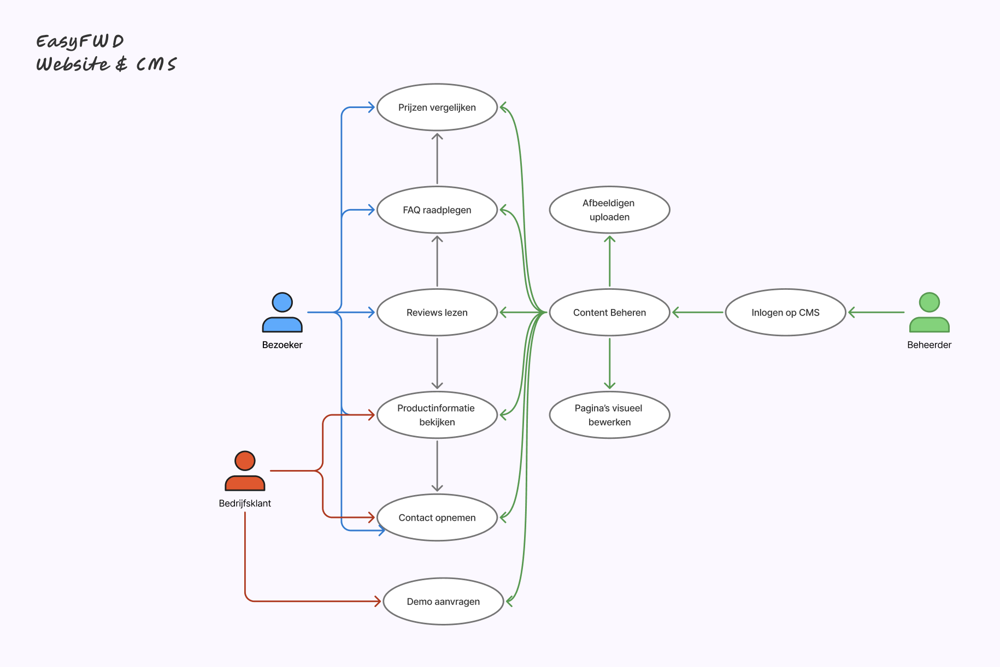

# Criterium 2.1 – Ontwerp

## Beschrijving

Voor de EasyFWD-website heb ik een functioneel ontwerp gemaakt dat inzicht geeft in de belangrijkste gebruikers en hun interacties met het systeem. Het doel is om helder te maken welke functionaliteiten de website en het CMS bieden, en hoe verschillende gebruikers(groepen) hiermee werken.

---

## Systeem

**Naam systeem:** EasyFWD Website & CMS

Het systeem bestaat uit een publieke website voor bezoekers en een beheerdersomgeving (CMS) voor het beheren van content, pagina's en media. De backend is opgezet met een API en biedt authenticatie, dataopslag en koppelingen met externe diensten zoals Cloudinary.

---

## Actoren

- **Bezoeker:** Iedereen die de website bezoekt en informatie zoekt over EasyFWD, EasyFlux of EasyAnalyse.
- **Bedrijfsklant:** Gebruiker die bijvoorbeeld een demo aanvraagt of contact opneemt voor zakelijke doeleinden.
- **Beheerder:** Medewerker die via het CMS content, pagina's en afbeeldingen beheert en nieuwe pagina's kan aanmaken.

---

## Use Cases

| Use Case                        | Actor(en)      | Beschrijving                                                        |
|----------------------------------|----------------|---------------------------------------------------------------------|
| Productinformatie bekijken       | Bezoeker       | Informatie over producten en diensten lezen.                        |
| Demo aanvragen                   | Bedrijfsklant  | Demo reserveren via een formulier.                                  |
| Contact opnemen                  | Bezoeker       | Contactformulier invullen en versturen.                             |
| Reviews lezen                    | Bezoeker       | Klantbeoordelingen en testimonials bekijken.                        |
| FAQ raadplegen                   | Bezoeker       | Antwoorden op veelgestelde vragen vinden.                           |
| Prijzen vergelijken              | Bezoeker       | Prijstabellen van pakketten bekijken.                               |
| Content beheren                  | Beheerder      | Pagina's, secties en producten beheren via het CMS.                 |
| Inloggen op CMS                  | Beheerder      | Veilig inloggen op de adminomgeving.                                |
| Afbeeldingen uploaden            | Beheerder      | Media uploaden en koppelen aan pagina's via Cloudinary.             |
| Pagina's visueel bewerken        | Beheerder      | Pagina's aanmaken, aanpassen en verwijderen met een visuele editor. |

---

## Speciale relaties

- **Validatie bij formulieren**: Bij het versturen van het contactformulier worden invoervelden altijd gecontroleerd op geldigheid.
- **Optionele velden**: Bij het aanvragen van een demo kan een bedrijfsnaam worden toegevoegd, maar dit is niet verplicht.

---

## Use Case Diagram

---

## Koppeling met Schematechnieken

De technische schema's en verdere uitwerking van de interacties zijn te vinden bij criterium 2.2.
