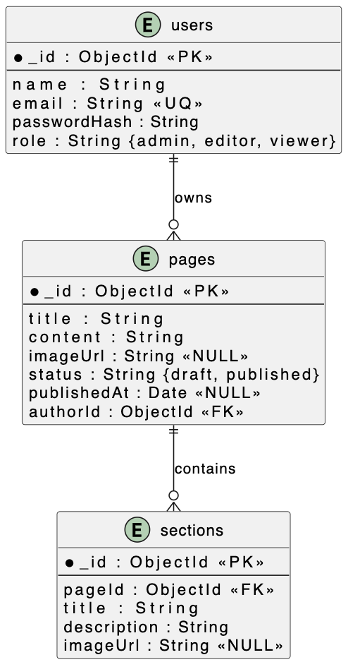

# Criterium 2.2 – Schematechnieken

## Inleiding

In deze sectie laat ik zien hoe ik verschillende schema's en diagrammen heb gebruikt om het ontwerp van de EasyFWD-website en het CMS te verduidelijken. Deze schema's helpen om de structuur, werking en datastromen van het systeem inzichtelijk te maken voor zowel ontwikkelaars als andere betrokkenen.

---

## Overzicht van gebruikte schema's

- **Use Case Diagram:** Laat zien welke gebruikers (bezoeker, bedrijfsklant, beheerder) welke acties kunnen uitvoeren op de EasyFWD-website en in het CMS.
- **Class Diagram (UML):** Geeft de datastructuur van het systeem weer, met klassen als User, Page, Product en hun onderlinge relaties.
- **Sequence Diagram:** Toont het verloop van een belangrijke interactie, zoals het inloggen van een beheerder of het aanmaken van een nieuwe pagina via het CMS.
- **ERD (Entity Relationship Diagram):** Visualiseert de database-structuur, met entiteiten als User, Page, Product en de relaties daartussen (zoals foreign keys).

---

## Use Case Diagram

**Toelichting:**
Het use case diagram geeft een overzicht van de belangrijkste gebruikers (actoren) en hun interacties met het systeem. Hiermee wordt in één oogopslag duidelijk welke functionaliteiten voor welke gebruikers beschikbaar zijn.

---

## Class Diagram (UML)

**Toelichting:**
Het class diagram laat de belangrijkste klassen en hun relaties zien, zoals User, Page, Product, etc. Dit geeft inzicht in de datastructuur en de koppelingen tussen verschillende onderdelen van het systeem.

---

## ERD (Entity Relationship Diagram)

**Toelichting:**
Het ERD geeft de structuur van de database weer, met tabellen (entiteiten) en de relaties daartussen. Dit is vooral belangrijk voor het backend- en datamodel.

---

## Sequence Diagram

**Toelichting:**
Het sequence diagram toont het verloop van een belangrijke interactie, bijvoorbeeld het inloggen van een beheerder of het aanmaken van een nieuwe pagina. Hiermee wordt duidelijk hoe de verschillende onderdelen samenwerken tijdens een proces.