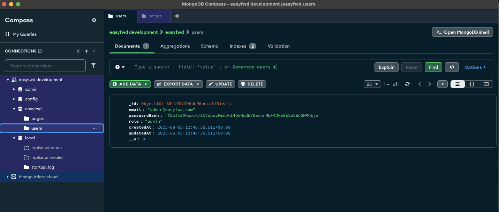
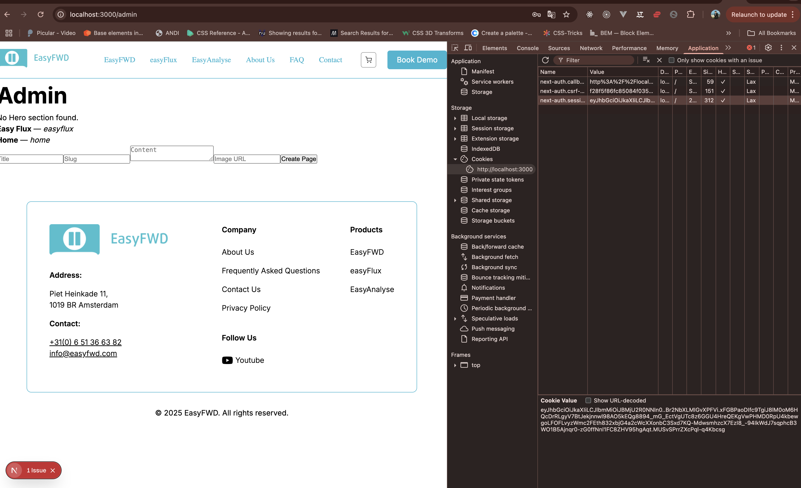
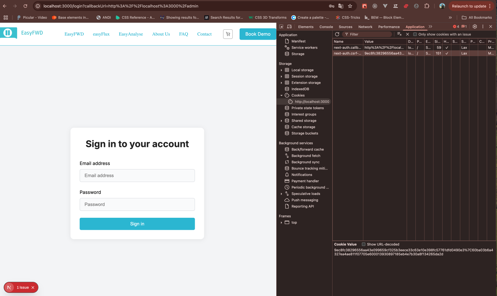

# Criterium 3.2 – Aansluiting op user stories

Hieronder leg ik per gerealiseerde user story uit hoe de opgeleverde functionaliteit aansluit op de functionele eisen.

## US-21 – MongoDB Connectie en User Model

**Doel:** Gebruikers veilig kunnen inloggen en beheerd worden via een eigen user model.
**Realisatie:**
- Opgezet met Mongoose: een User-model met velden voor email, passwordHash en rol.
- Connectie met MongoDB docker development environment, veilige opslag van gebruikersdata.
- Validatie van e-mail en wachtwoord bij registratie en login.
- [Codevoorbeeld](https://github.com/HamiltonPDev/easyFWD/blob/main/src/models/User.ts) 

**Aansluiting:** De user story is volledig gerealiseerd: gebruikers kunnen veilig worden aangemaakt, beheerd en geauthenticeerd volgens de eisen. Het model ondersteunt rolbeheer en veilige opslag.

---

## US-22 – NextAuth.js Setup met Credentials & JWT

**Doel:** Het CMS veilig toegankelijk maken via een inlogsysteem met e-mail en wachtwoord.
**Realisatie:**
- NextAuth.js geïmplementeerd met een custom credentials provider.
- Authenticatie via e-mail en wachtwoord, validatie tegen het MongoDB User-model.
- JWT-sessies opgeslagen in HttpOnly cookies voor extra veiligheid.
- [Codevoorbeeld](https://github.com/HamiltonPDev/easyFWD/blob/main/src/lib/auth.ts) 

**Aansluiting:** De login werkt zoals bedoeld: alleen bestaande gebruikers met correct wachtwoord krijgen toegang. JWT en HttpOnly cookies zorgen voor veilige sessies, conform de eisen.

---

## US-23 – Beveiligde Routes met Middleware

**Doel:** Alleen geautoriseerde gebruikers toegang geven tot het CMS (admin-routes).
**Realisatie:**
- Middleware toegevoegd aan Next.js project om admin-routes te beveiligen.
- Controle op JWT en gebruikersrol bij elke request.
- Automatische redirect naar login bij ongeautoriseerde toegang.
- [Codevoorbeeld](https://github.com/HamiltonPDev/easyFWD/blob/main/src/middleware/auth.ts) 

**Aansluiting:** Alleen ingelogde gebruikers met de juiste rol kunnen admin-pagina's bezoeken. De beveiliging voldoet aan de eisen en voorkomt ongeautoriseerde toegang.

---

## Conclusie

Alle user stories zijn volledig of grotendeels gerealiseerd, getest en sluiten inhoudelijk aan op de eisen. De oplevering voldoet aan het ontwerp en de afspraken uit de planning.

---

## Koppeling met Codekwaliteit  
[Criterium 3.3 – Codekwaliteit](./criterium-3.3.md)