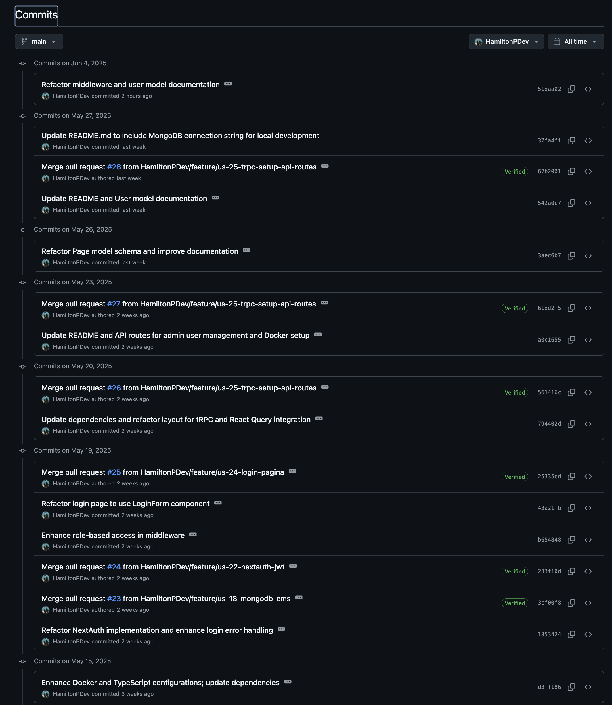
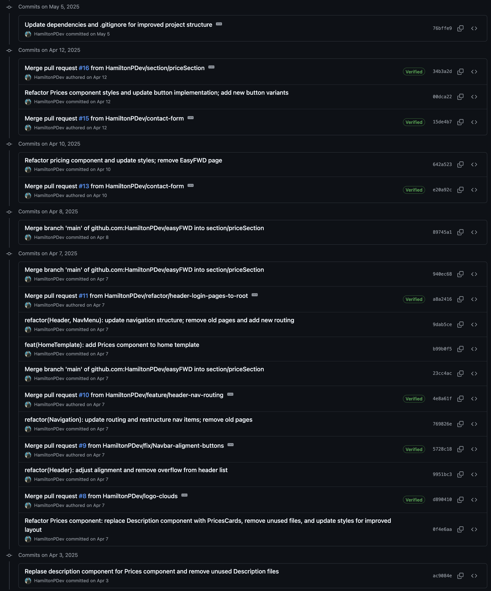
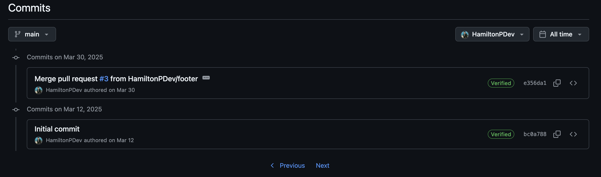
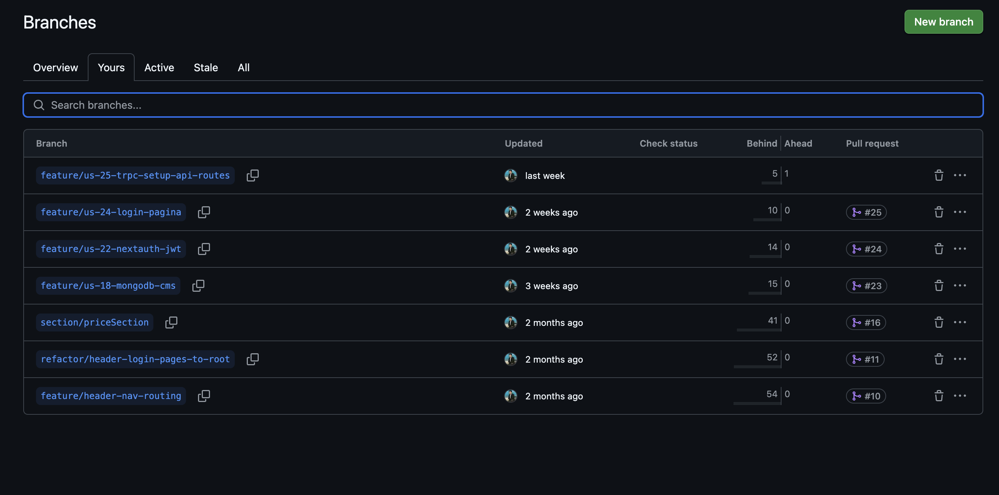
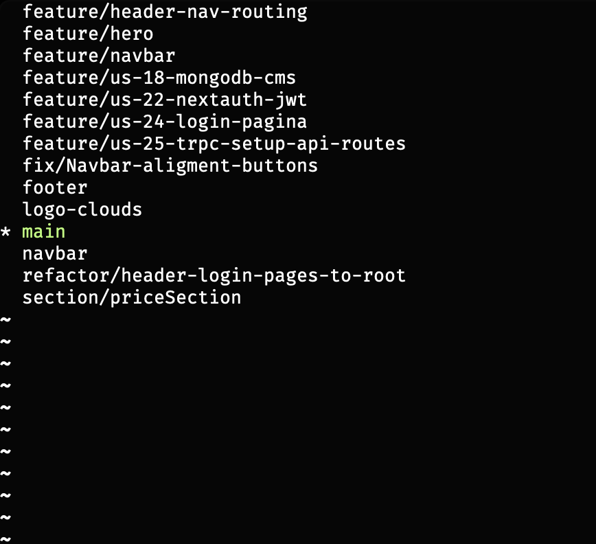

# Criterium 3.6 – Versiebeheer

## Repository
- [Link naar GitHub repository](https://github.com/HamiltonPDev/easyFWD)

## Commit history
- Het project bevat meer dan 10 commits, verspreid over de ontwikkelperiode.
- Voorbeelden van commit messages uit het project:
  - `Update dependencies and .gitignore for improved project structure`
  - `Refactor Prices component styles and update button implementation; add new button variants`
  - `Refactor pricing component and update styles; remove EasyFWD page`
  - `Refactor Page model schema and improve documentation`
  - `Enhance role-based access in middleware`
  - `Refactor NextAuth implementation and enhance login error handling`
  - `Update README and API routes for admin user management and Docker setup`
  - `Merge pull request #25 from HamiltonPDev/feature/us-24-login-pagina`
  - `Merge pull request #24 from HamiltonPDev/feature/us-22-nextauth-jwt`
  - `Initial commit`
- Zie screenshot voor commit-overzicht.

## Branches & workflow
- Er is gewerkt met meerdere branches, bijvoorbeeld:
  - `main` (productie)
  - `feature/header-nav-routing`
  - `feature/hero`
  - `feature/navbar`
  - ..enzovoort
- Pull requests zijn gebruikt om features samen te voegen na review.
- Zie screenshot voor branch-overzicht en pull requests.

## Bewijs

- **Commit history:**  
  
  
  

- **Branches en workflow:**  
  
  

## Conclusie
Het project is gestructureerd beheerd met versiebeheer. De workflow is professioneel en voldoet aan de eisen voor het examen. 