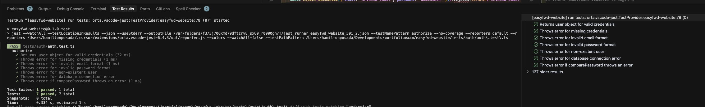
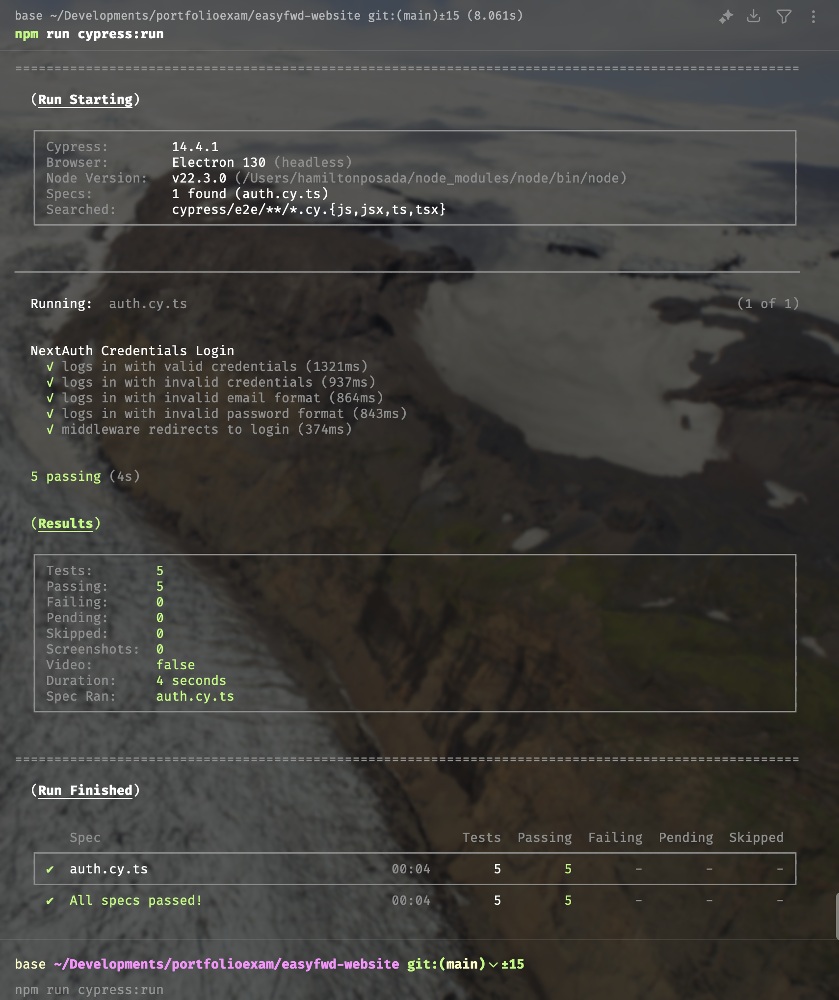

# TEST REPORT

## Testen van de applicatie

Voor het testen van de applicatie zijn zowel **unit tests** (met Jest) als **end-to-end tests** (met Cypress) gebruikt. Hiermee is de betrouwbaarheid en veiligheid van het authenticatiesysteem en de login-functionaliteit gecontroleerd.

### Unit tests (Jest)
- Locatie: `easyfwd-website/tests/auth/auth.test.ts`
- Testdoel: Controleren van de `authorize` functie voor login/authenticatie.
- Resultaat: **Alle 7 tests geslaagd**

**Voorbeeld testcases:**
- Geldige inloggegevens geven een gebruikersobject terug
- Foutmelding bij ontbrekende of foutieve gegevens
- Foutmelding bij niet-bestaande gebruiker of databasefout

**Testresultaat (Jest):**
```
PASS  tests/auth/auth.test.ts
✓ Returns user object for valid credentials
✓ Throws error for missing credentials
✓ Throws error for invalid email format
✓ Throws error for invalid password format
✓ Throws error for non-existent user
✓ Throws error for database connection error
✓ Throws error if comparePassword throws an error

Test Suites: 1 passed, 1 total
Tests:       7 passed, 7 total
```

### End-to-end tests (Cypress)
- Locatie: `easyfwd-website/cypress/e2e/auth.cy.ts`
- Testdoel: Testen van het volledige loginproces via de UI, inclusief validatie en redirects.
- Resultaat: **Alle 5 tests geslaagd**

**Voorbeeld testcases:**
- Inloggen met geldige en ongeldige gegevens
- Validatie van e-mail en wachtwoordformaat
- Middleware redirect naar login bij ongeautoriseerde toegang

**Testresultaat (Cypress):**
```
All specs passed!
Spec Ran: auth.cy.ts
Tests: 5 passing
```

### Screenshots van testresultaten
#### Jest testresultaat


#### Cypress testresultaat



---

## Conclusie

Alle relevante scenario's zijn getest en geslaagd. Het systeem is veilig en robuust bevonden voor authenticatie en autorisatie. 