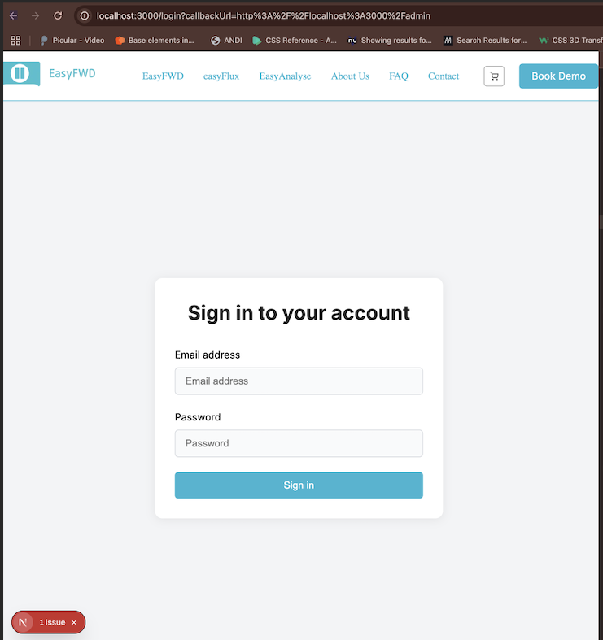

# Criterium 6.3 & 6.4: Afspraken

## Eisen
- Minimaal 3 afspraken, SMART geformuleerd
- Afspraken zijn eenduidig vastgelegd (actiepunt, tijd, verantwoordelijke, opvolging, betrokkenen)
- Bewijs dat je je aan de afspraken hebt gehouden

## Gemaakte afspraken (SMART)

| Actiepunt | Verantwoordelijke | Deadline | Opvolging | Betrokkenen |
|-----------|-------------------|----------|-----------|-------------|
| Backendstructuur opzetten voor Sprint 4 (US-18) | Hamilton | 15 april 2025 | Prototype backend aangemaakt, commit [3cf00f8] | Hamilton, team |
| Navbar font aanpassen naar "Roboto" (US-3) | Hamilton | 13 april 2025 | Commit [5fb4769] uitgevoerd, font-family aangepast | Hamilton, Tom |
| Login-button toevoegen aan EasyAnalyse-pagina | Hamilton | 14 april 2025 | **Nog niet afgerond, staat op de planning voor Sprint 4.** Login functionaliteit werkt al via [http://localhost:3000/login](http://localhost:3000/login) | Hamilton, Tom |

## Bewijs van naleving afspraken

- **Backendstructuur:** Zie commit [3cf00f8 – Merge pull request #23 from HamiltonPDev/feature/us-18-mongodb-cms](https://github.com/HamiltonPDev/easyFWD/commit/3cf00f8) en backend prototype in de repository. Pull request: #23 – feature/us-18-mongodb-cms (gemerged, verified).
- **Navbar font:** Zie commit [5fb4769 – Update global styles, add shopping cart icon, and implement navigation menu with animations](https://github.com/HamiltonPDev/easyFWD/commit/5fb4769).
- **Login-button:** Nog niet afgerond. De login functionaliteit werkt al via [http://localhost:3000/login](http://localhost:3000/login), maar de knop op EasyAnalyse moet nog worden toegevoegd.

